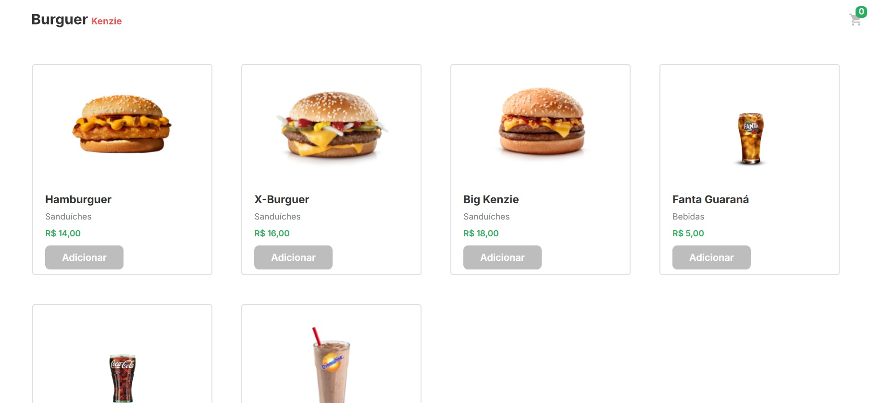

# 🛒 Projeto: Carrinho de Compras com React

Este projeto foi desenvolvido como parte do curso da Kenzie Academy. O objetivo é implementar funcionalidades e estilização em um projeto React existente, simulando o funcionamento de um e-commerce com integração à API de produtos e gerenciamento de carrinho de compras.

---

## 📋 Descrição

A aplicação permite ao usuário:

- Visualizar produtos obtidos de uma API externa;
- Adicionar e remover itens no carrinho de compras;
- Visualizar o total da compra;
- Persistir os dados do carrinho com `localStorage`;
- Interagir com um modal simples;
- (Desafio) Utilizar comportamentos avançados no modal como fechar ao clicar fora ou pressionar a tecla `Esc`;
- (Opcional) Implementar funcionalidade de busca por produto.

---

## 🚀 Tecnologias Utilizadas

- React
- JavaScript (ES6+)
- Sass (SCSS)
- API de produtos

---

## 💡 Funcionalidades Implementadas

- 🎯 Estilização baseada em Figma com SCSS
- 📦 Listagem dinâmica de produtos com `useEffect`
- 🛍️ Gerenciamento completo de carrinho (adicionar, remover, somar total)
- 💾 Persistência de dados no `localStorage`
- 🧩 Modal com comportamento condicional (abrir e fechar)
- 🧪 (Extra) Modal com hooks personalizados para fechamento por clique externo ou tecla `Esc`

---

## 🖼️ Capturas de Tela

### 💻 Versão Desktop



---

## 🖥️ Clonar o Projeto

1. Clone o repositório:

   ```bash
   git clone https://github.com/dkrausz/hamburgueria-kenzie.git
   ```

2. Abra a pasta do projeto:

   ```bash
    cd hamburgueria-kenzie
   ```

3. Execute o comando

   ```bash
    npm run dev
   ```

## 🔗 Acesso ao Projeto

- Repositório GitHub: [https://github.com/dkrausz/hamburgueria-kenzie](https://github.com/dkrausz/hamburgueria-kenzie)
- Vercel Page: [https://react-entrega-s3-template-hamburgueria-dkrausz-75rjpl8fy.vercel.app/](https://react-entrega-s3-template-hamburgueria-dkrausz-75rjpl8fy.vercel.app/)

---

## 📝 Licença

Este projeto é de uso educacional e não possui uma licença específica.
